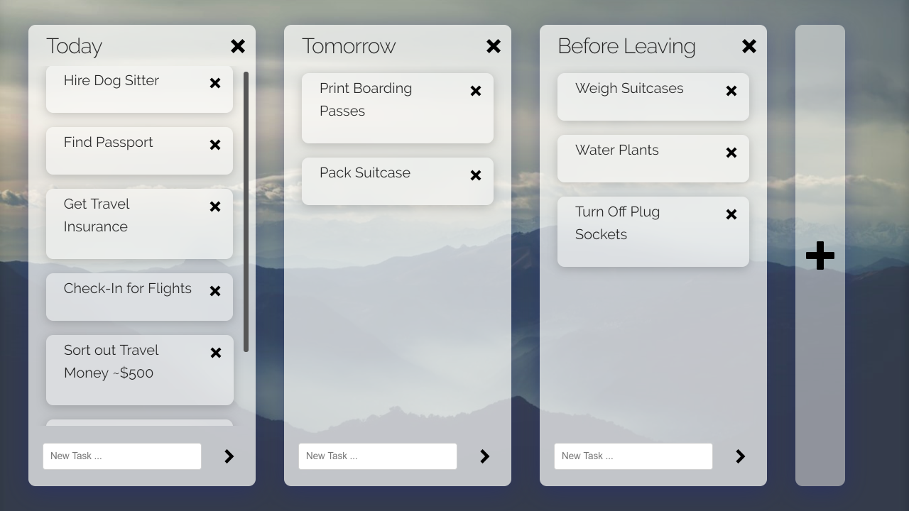

# React Kanban Board
A Trello-Style Kanban Task Manager that runs in the browser, built with React.

## Release
The latest release can be found at  
https://ganeshh123.github.io/kanban-board/

## Features
- Create Multiple Lists of Tasks
- Drag and Drop Tasks to move them through stages between lists
- Editable List and Task Names
- Persistent Client Side Storage

## Building
There is no need to build. The app uses script tags to load in React, React DND, and Babel.
### Running Locally
1. Download or clone this repository
2. Open index.html
### Technology Stack
- React for List and Task Components
- React DND for draggable tasks
- Javascript Browser Local Storage
- Compiled with Babel

## Credits
- [Icons from IcoMoon](https://icomoon.io/app/#/select)
- [Background Image](https://unsplash.com/photos/zxcBR3zNc7I)

